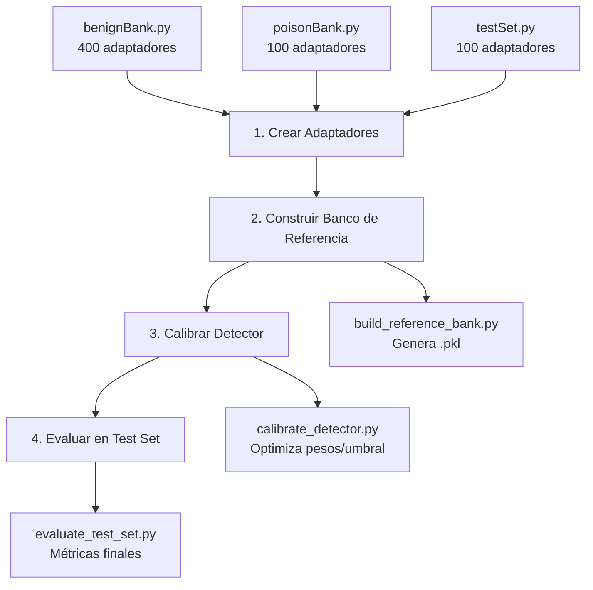

# 🛡️ LoRA Backdoor Detection

Sistema de detección de backdoors en adaptadores LoRA usando análisis geométrico avanzado.

## 📋 Descripción

Este proyecto implementa un detector de backdoors para adaptadores LoRA entrenados en modelos de lenguaje. Utiliza un pipeline de dos etapas con 5 métricas geométricas para identificar adaptadores potencialmente comprometidos.

## ✨ Características

- 🔍 **Detección en dos etapas**: Fast Scan (filtrado rápido) + Deep Scan (análisis profundo)
- 📊 **5 métricas geométricas**: σ₁, Frobenius, E_σ₁, Entropy, Kurtosis
- 🎯 **Enfoque en Layer 21**: Análisis específico en la capa 20 (índice)
- 📈 **Calibración automática**: Optimización de pesos y umbrales
- 🧪 **Evaluación completa**: Métricas ROC-AUC, precisión, recall

## 🏗️ Estructura del Proyecto

```
loraBackdoorDetection/
├── 📁 bankCreation/          # Creación de bancos de adaptadores
│   ├── benignBank.py         # Genera 400 adaptadores benignos
│   ├── poisonBank.py         # Genera 100 adaptadores envenenados
│   ├── testSet.py            # Genera conjunto de prueba (100 adaptadores)
│   └── build_reference_bank.py  # Construye el banco de referencia
│
├── 📁 core/                  # Núcleo del detector
│   ├── detector.py           # Detector principal (pipeline completo)
│   ├── benign_bank.py        # Banco de referencia benigno
│   ├── fast_scan.py          # Escaneo rápido (filtrado)
│   └── deep_scan.py          # Análisis profundo (métricas completas)
│
├── 📁 evaluation/            # Evaluación y calibración
│   ├── calibrate_detector.py # Calibra pesos y umbrales
│   └── evaluate_test_set.py  # Evalúa en conjunto de prueba
│
└── 📁 output/                # Resultados generados
    ├── benign/               # Adaptadores benignos
    ├── poison/               # Adaptadores envenenados
    ├── test/                 # Conjunto de prueba
    └── referenceBank/        # Banco de referencia (.pkl)
```

## 🔄 Pipeline de Trabajo



## 🚀 Instalación

### Requisitos
- Python 3.8+
- CUDA (recomendado para GPU)
- HuggingFace token (para descargar modelos)

### Pasos

1. **Clonar el repositorio**
```bash
git clone <repository-url>
cd loraBackdoorDetection
```

2. **Instalar dependencias**
```bash
pip install -r requirements.txt
```

3. **Configurar variables de entorno**
```bash
# Crear archivo .env
echo "HF_TOKEN=tu_token_aqui" > .env
```

## 📖 Uso

### 1️⃣ Crear Banco de Adaptadores

**Adaptadores Benignos (400)**
```bash
python bankCreation/benignBank.py
```
⏱️ Tiempo estimado: 8-12 horas

**Adaptadores Envenenados (100)**
```bash
python bankCreation/poisonBank.py
```

**Conjunto de Prueba (100)**
```bash
python bankCreation/testSet.py
```

### 2️⃣ Construir Banco de Referencia

```bash
python bankCreation/build_reference_bank.py
```
📦 Genera: `output/referenceBank/benign_reference_bank.pkl`

### 3️⃣ Calibrar Detector

```bash
python evaluation/calibrate_detector.py
```
🎯 Optimiza pesos y umbrales automáticamente

### 4️⃣ Evaluar Detector

```bash
python evaluation/evaluate_test_set.py --threshold 0.55
```

O usar el umbral calibrado automáticamente:
```bash
python evaluation/evaluate_test_set.py
```

## 🔬 Métricas de Detección

El detector utiliza **5 métricas geométricas**:

| Métrica | Descripción | Comportamiento en Backdoors |
|---------|-------------|----------------------------|
| **σ₁** | Valor singular principal | ⬆️ Más alto |
| **Frobenius** | Norma total de pesos | ⬆️ Más alto |
| **E_σ₁** | Energía espectral | ⬆️ Más concentrada |
| **Entropy** | Entropía espectral | ⬇️ Más baja |
| **Kurtosis** | Forma de distribución | ⬆️ Más alta |

**Pesos por defecto**: `[0.30, 0.25, 0.20, 0.15, 0.10]`

## 🎯 Configuración

### Layer Target
- **Layer 21** (índice 20) - Única capa analizada
- Módulos: `q_proj`, `k_proj`, `v_proj`, `o_proj`

### Modelo Base
- **Llama-3.2-3B-Instruct** (meta-llama/Llama-3.2-3B-Instruct)

### Configuración LoRA
- Rank: 16
- Alpha: 32
- Dropout: 0.05

## 📊 Resultados

Los resultados se guardan en:
- `output/evaluation/evaluation_report.json` - Reporte completo
- `output/evaluation/evaluation_results.png` - Visualizaciones
- `output/referenceBank/benign_reference_bank_detector_config.pkl` - Configuración del detector

## 🔧 Uso Programático

```python
from core.benign_bank import BenignBank
from core.detector import BackdoorDetector

# Cargar banco de referencia
bank = BenignBank("output/referenceBank/benign_reference_bank.pkl")

# Crear detector
detector = BackdoorDetector(bank)

# Escanear adaptador
result = detector.scan("path/to/adapter")
print(f"Score: {result['score']}")
print(f"Es backdoor: {result['score'] >= detector.threshold}")
```

## 📝 Notas

- ⚠️ Los adaptadores del conjunto de prueba **NO** deben usarse durante el desarrollo
- 🔄 La calibración optimiza automáticamente los pesos y umbrales
- 💾 Los archivos `.pkl` contienen el banco de referencia y la configuración del detector

## 📄 Licencia

[Especificar licencia]

## 👥 Autores

[Especificar autores]

---

**⚠️ Importante**: Este proyecto es para investigación y detección de backdoors. Úsalo responsablemente.

