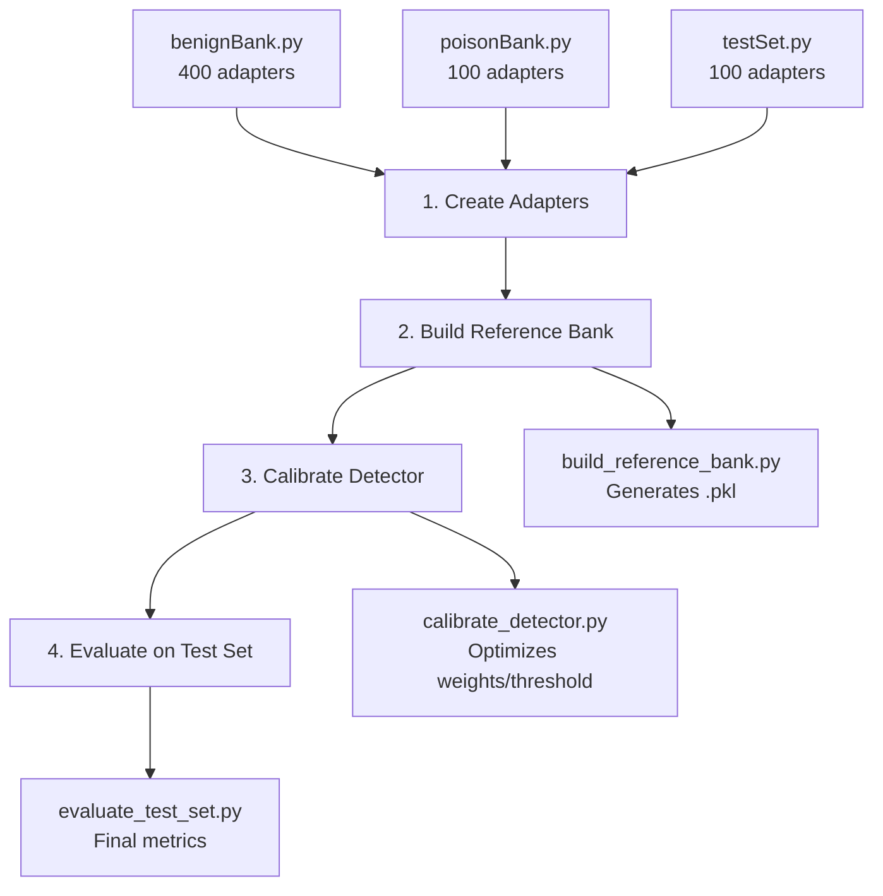

# 🛡️ LoRA Backdoor Detection

Backdoor detection system for LoRA adapters using advanced geometric analysis.

## 📋 Description

This project implements a backdoor detector for LoRA adapters trained on language models. It uses a two-stage pipeline with 5 geometric metrics to identify potentially compromised adapters.

## ✨ Features

- 🔍 **Two-stage detection**: Fast Scan (quick filtering) + Deep Scan (deep analysis)
- 📊 **5 geometric metrics**: σ₁, Frobenius, E_σ₁, Entropy, Kurtosis
- 🎯 **Layer 21 focus**: Specific analysis on layer 20 (index)
- 📈 **Automatic calibration**: Optimizes weights and thresholds
- 🧪 **Complete evaluation**: ROC-AUC, precision, recall metrics

## 🏗️ Project Structure

```
loraBackdoorDetection/
├── 📁 bankCreation/          # Adapter bank creation
│   ├── benignBank.py         # Generates 400 benign adapters
│   ├── poisonBank.py         # Generates 100 poisoned adapters
│   ├── testSet.py            # Generates test set (100 adapters)
│   └── build_reference_bank.py  # Builds reference bank
│
├── 📁 core/                  # Detector core
│   ├── detector.py           # Main detector (complete pipeline)
│   ├── benign_bank.py        # Benign reference bank
│   ├── fast_scan.py          # Fast scanning (filtering)
│   └── deep_scan.py          # Deep analysis (full metrics)
│
├── 📁 evaluation/            # Evaluation and calibration
│   ├── calibrate_detector.py # Calibrates weights and thresholds
│   └── evaluate_test_set.py  # Evaluates on test set
│
└── 📁 output/                # Generated results
    ├── benign/               # Benign adapters
    ├── poison/               # Poisoned adapters
    ├── test/                 # Test set
    └── referenceBank/         # Reference bank (.pkl)
```

## 🔄 Workflow Pipeline



## 🚀 Installation

### Requirements
- Python 3.8+
- CUDA (recommended for GPU)
- HuggingFace token (to download models)

### Steps

1. **Clone the repository**
```bash
git clone <repository-url>
cd loraBackdoorDetection
```

2. **Install dependencies**
```bash
pip install -r requirements.txt
```

3. **Configure environment variables**
```bash
# Create .env file
echo "HF_TOKEN=your_token_here" > .env
```

## 📖 Usage

### 1️⃣ Create Adapter Bank

**Benign Adapters (400)**
```bash
python bankCreation/benignBank.py
```
⏱️ Estimated time: 8-12 hours

**Poisoned Adapters (100)**
```bash
python bankCreation/poisonBank.py
```

**Test Set (100)**
```bash
python bankCreation/testSet.py
```

### 2️⃣ Build Reference Bank

```bash
python bankCreation/build_reference_bank.py
```
📦 Generates: `output/referenceBank/benign_reference_bank.pkl`

### 3️⃣ Calibrate Detector

```bash
python evaluation/calibrate_detector.py
```
🎯 Automatically optimizes weights and thresholds

### 4️⃣ Evaluate Detector

```bash
python evaluation/evaluate_test_set.py --threshold 0.55
```

Or use the automatically calibrated threshold:
```bash
python evaluation/evaluate_test_set.py
```

## 🔬 Detection Metrics

The detector uses **5 geometric metrics**:

| Metric | Description | Behavior in Backdoors |
|--------|-------------|----------------------|
| **σ₁** | Leading singular value | ⬆️ Higher |
| **Frobenius** | Total weight norm | ⬆️ Higher |
| **E_σ₁** | Spectral energy | ⬆️ More concentrated |
| **Entropy** | Spectral entropy | ⬇️ Lower |
| **Kurtosis** | Distribution shape | ⬆️ Higher |

**Default weights**: `[0.30, 0.25, 0.20, 0.15, 0.10]`

## 🎯 Configuration

### Target Layer
- **Layer 21** (index 20) - Only layer analyzed
- Modules: `q_proj`, `k_proj`, `v_proj`, `o_proj`

### Base Model
- **Llama-3.2-3B-Instruct** (meta-llama/Llama-3.2-3B-Instruct)

### LoRA Configuration
- Rank: 16
- Alpha: 32
- Dropout: 0.05

## 📊 Results

Results are saved in:
- `output/evaluation/evaluation_report.json` - Complete report
- `output/evaluation/evaluation_results.png` - Visualizations
- `output/referenceBank/benign_reference_bank_detector_config.pkl` - Detector configuration

## 🔧 Programmatic Usage

```python
from core.benign_bank import BenignBank
from core.detector import BackdoorDetector

# Load reference bank
bank = BenignBank("output/referenceBank/benign_reference_bank.pkl")

# Create detector
detector = BackdoorDetector(bank)

# Scan adapter
result = detector.scan("path/to/adapter")
print(f"Score: {result['score']}")
print(f"Is backdoor: {result['score'] >= detector.threshold}")
```

## 📝 Notes

- ⚠️ Test set adapters **MUST NOT** be used during development
- 🔄 Calibration automatically optimizes weights and thresholds
- 💾 `.pkl` files contain the reference bank and detector configuration

## 📄 License

[Specify license]

## 👥 Authors

[Specify authors]

---

**⚠️ Important**: This project is for research and backdoor detection. Use responsibly.
